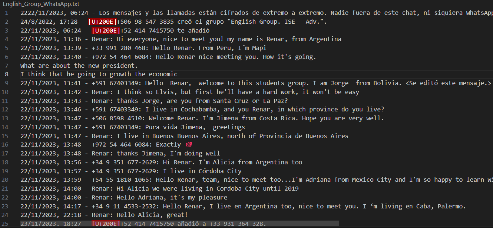
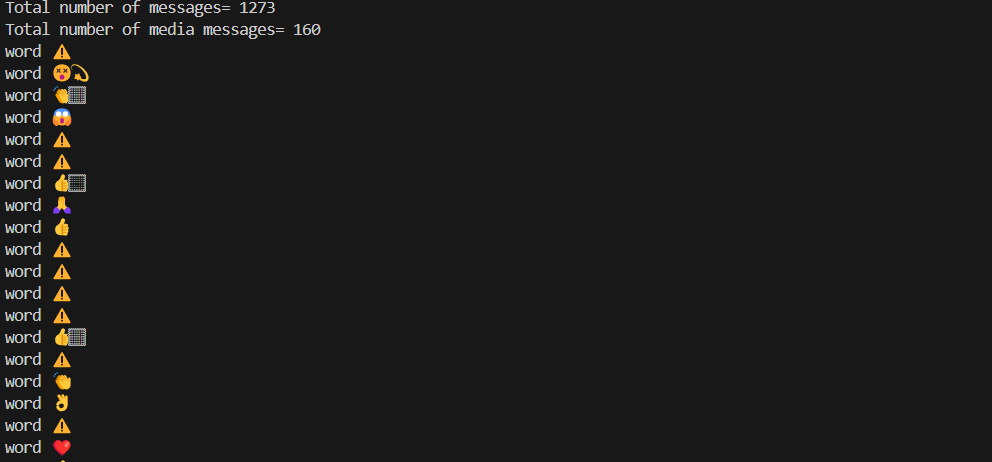
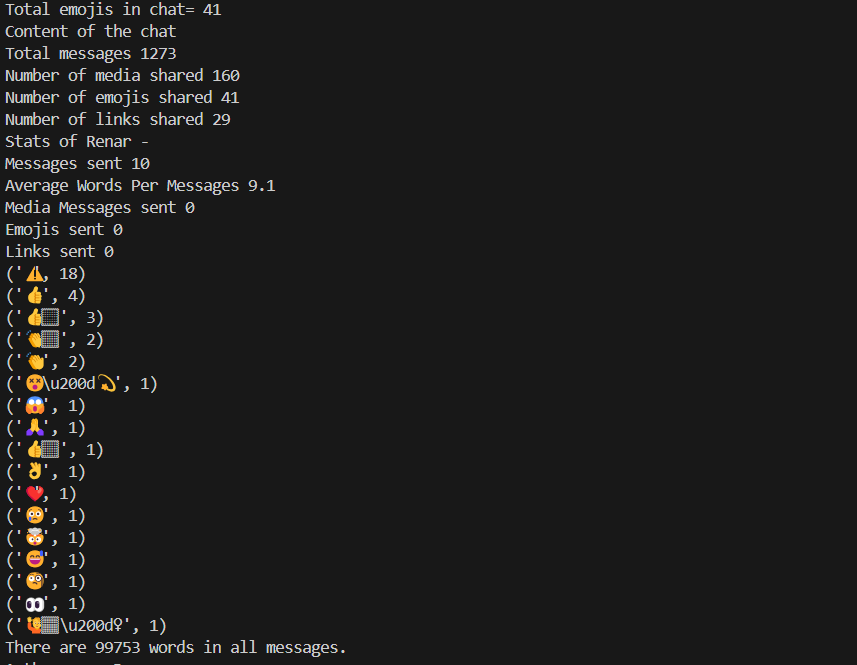
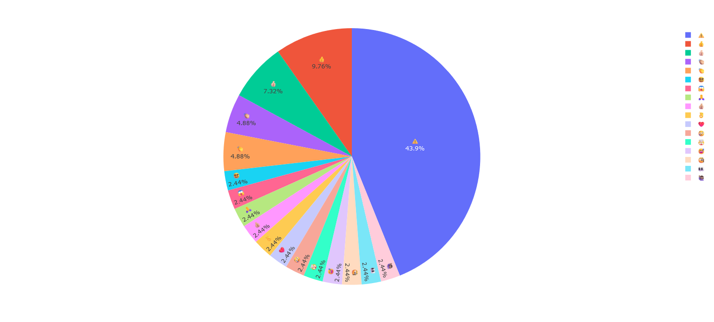
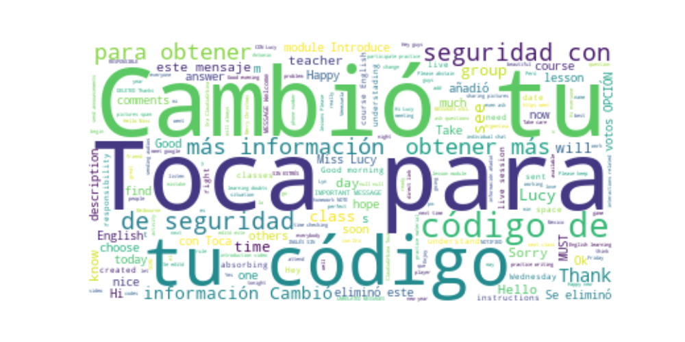
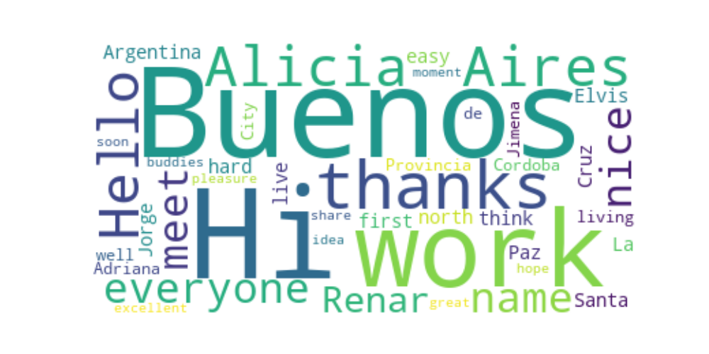
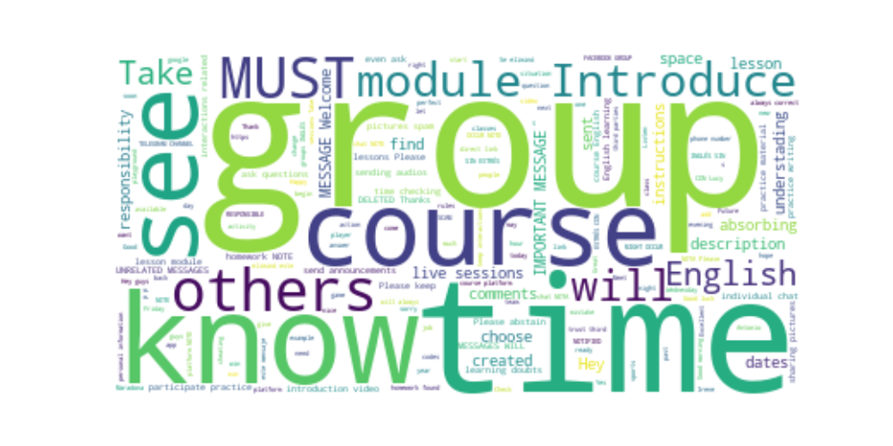

**WhatsApp Chat Analysis**
================

**we analyze an English Learning WhatsApp**
-------------------------------------------

We can find a lot of information from our own or Bussiness WhatsApp messages, which can also help us to solve business problems
or find new business oportunities. WhatsApp data could be used for many data science tasks like sentiment analysis, 
keyword extraction, named entity recognition and so on.

### ETL Process
In this process we took an exported file from WhatsApp chat, then it converted in a Pandas datafram, with four columns, Date, Time, Author and Message.

### EDA Process
Here We got significant insights like total messages, total media messages, total shared links and then we got data from chat's users'
We used Pieplot and Worlmaps.

# Total emojis present in the chat and the type of emojis sent between two peoples.

# Let’s have a look at the most used words in this WhatsApp chat by visualizing a word cloud

# Let’s have a look at the most used words by each person by visualizing two different word clouds
# First user

# Second user

### Usage

# Generate one instance of WhatsAppChatAnalyzer, then We choosen two users within a Dictionary, run gen_dataset to get 
# a Panda dataframe from a txt file WhatsApp chat and last run eda_process to obtain signicant insights.

**Authors**
------------

* Renar Zamora - renarzamora@gmail.com

**Tools**
----------------

* Python 3.11, Visual Studio Code, Matplotlib, Plotly, WordCloud, Emoji, Collections, Pandas and Numpy